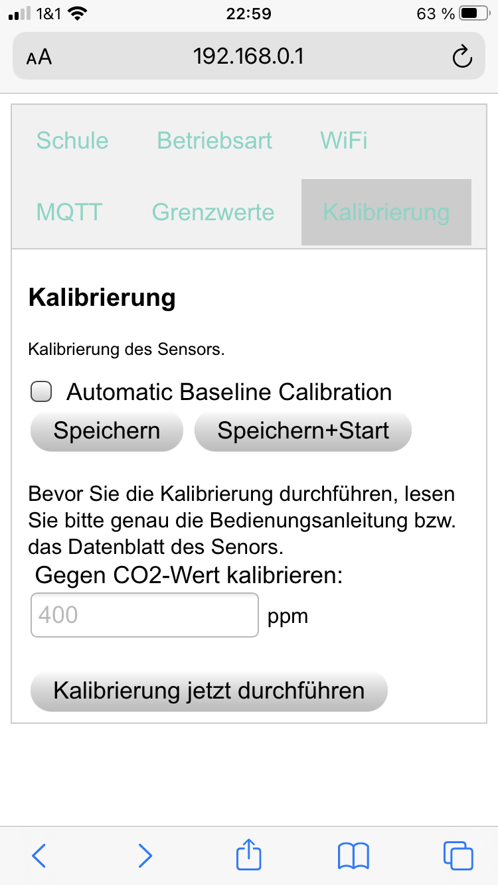

[//]: # $if(geometry)$
[//]: # \usepackage[$for(geometry)$$geometry$$sep$,$endfor$]{geometry}
[//]: # $endif$

Benutzerinformationen und Haftungsausschluss CO2-Meter
=======================================================

Hintergrund
===========

CO2 Messungen, warum?
-----------------------------------

Das Handelsblatt veröffentlichte in einem Artikel
_Wie wahrscheinlich ist eine Infektion im Klassenzimmer? Diese Grafiken zeigen es_[^1]
wie sich Aerosole in Klassenzimmern ausbreiten und wie Schutzmaßnahmen wie das Tragen von Masken
und das regelmäßige Lüften helfen, die Aerosolbelastung (und damit ein Ansteckungsrisiko mit COVID-19) reduzieren.

Auch das Bundesumweltamt (BMU) informiert auf seinen Internetseiten[^2],
dass regelmäßiges Lüften hilft, die Aerosolbelastung zu reduzieren.
Darüber hinaus wird ebenfalls empfohlen, CO2-Ampeln einzusetzen, um einen Indikator
dafür zu haben, wenn die Luft in einem Raum "verbraucht" ist und das Lüften angeraten ist.

Die natürliche CO2-Konzentration in der Atmosphäre liegt bei ca. 400 ppm[^3].
Beim Ausatmen stoßen Menschen ca. 4 % Kohlendioxid aus (ca. 40.000 ppm), die sich in der Raumluft verteilt.
Wenn Personen in einem Raum ohne Belüftung zusammen sind, steigt damit zwangsläufig die Konzentration von Kohlendioxid im Raum.
Laut Bundesumweltamt gilt eine CO2 -Belastung bis 1000 ppm noch als gut, über 2000 ppm als schlecht.
Eine Studie des BMU[^4] veröffentlicht verschiedene Untersuchungen zu CO2-Konzentration in
unterschiedlichen Umgebungssituationen wie Schulen, Kitas, dem häuslichen Umfeld oder dem Arbeitsplatz.

[^1]: <https://www.handelsblatt.com/technik/medizin/coronavirus-wie-wahrscheinlich-ist-eine-infektion-im-klassenzimmer-diese-grafiken-zeigen-es/26622046.html?ticket=ST-16153534-ZSYxLJQCsUFPcu2oVHne-ap5>

[^2]: <https://www.umweltbundesamt.de/richtig-lueften-in-schulen>

[^3]: ppm steht für "parts per million", d.h. für die Anzahl der Teilchen gemessen pro Millionen Teilchen.

[^4]: <https://www.umweltbundesamt.de/sites/default/files/medien/pdfs/kohlendioxid_2008.pdf>

### Verfügbarkeit von CO2 Ampeln und Ziele des Projektes CO2-Meter

Die Messung der Kohlenstoffkonzentration gibt also einen Indikator dafür, wann die Luft in einem Raum verbraucht ist und wann spätestens wieder gelüftet werden sollte. Daher sind gerade viele Schulen gerade dabei Messgeräte anzuschaffen, die am Markt erhältlich sind. Das Problem ist allerdings, das viele Geräte wegen der erhöhten Nachfrage nicht mehr oder erst später verfügbar sind.

Im den "Maker Communities" im Internet kursieren Bauanleitungen, die zeigen, wie man mit Elektronikbauteilen, die am Markt erhältlich sind, selber eine CO2-Ampel bauen kann.[^5]
Unabhängig davon hat sich eine Projektgruppe an der FH Aachen zusammengefunden, um ebenfalls einen solchen Bausatz zu entwickeln. Dabei haben wir verschiedene Sensoren in unterschiedlichen Preiskategorien untersucht und evaluiert.

Die Ergebnisse unserer Untersuchen mündeten in der Idee, Schulen beim Eigenbau von CO2-Ampeln zu unterstützen. Diese Idee führte zur Entwicklung vom gegenwärtigen Bausatz und der Entwicklung der aktuellen Firmware.

Um den Bausatz auch für Schulprojekte verfügbar zu machen, gründeten T. Dey, I. Elsen, A. Ferrein, T. Frauenrath, M. Reke und S. Schiffer die CO2Meter GbR.

[^5]: <https://www.heise.de/select/make/2020/5/2022015381334973804>

### Sensortypen und Messprinzipien

Es gibt grundsätzlich 2 unterschiedliche Typen von Sensoren, die auf unterschiedlichen Messprinzipien beruhen:

* VOC
* NDIR

*VOC* steht für "Volatile Organic Compounds" (z.B. [^6])
und sind in der Lage Veränderungen an Gaskonzentrationen zu messen.
Solche Sensoren sind damit in der Lage, bestimmte Ausgasungen von Benzol,
Alkohol und anderen organischen Verbindungen zu detektieren.
Solche Sensoren messen auch CO2, das jedoch nur indirekt.
Die Annahme ist, dass in einem Innnenraum wie z.B. einem Klassenzimmer, andere gasförmigen
Verbindungen nicht vorkommen und dass daher der gemessene Wert der CO2-Konzentration entspricht.
Solche Sensoren sind im allgemeinen auch sehr preisgünstig.
Unsere Erfahrungen und Messungen haben ergeben, dass sich solche Sensoren
nicht gut dafür eignen, den CO2-Gehalt zuverlässig in einem Klassenraum zu bestimmen.

[^6]: <https://www.umweltbundesamt.de/themen/gesundheit/umwelteinfluesse-auf-den-menschen/chemische-stoffe/fluechtige-organische-verbindungen#welche-gesundheitlichen-wirkungen-konnen-voc-haben>

*NDIR* steht für "nondispersive infrared sensor".
Das Prinzip beruht darauf, spektroskopisch mit Hilfe von Infrarotlicht die Konzentration von Gasen zu detektieren.
Diese Sensoren eignen sich zur genauen Bestimmung von CO2-Konzentration sehr viel besser als VOC-Sensoren.
Die Sensoren sind jedoch aufgrund der komplexeren Messmethode und der aufwendigen Kalibrierung wesentlich teurer als VOC-Sensoren.

Für eine zuverlässige Messung der echten CO2-Konzentration kommen mithin nur NDIR Sensoren in Betracht.

Bausatz
=======

Ziel unserer Bestrebungen war ist die Enwicklung eines Bausatzes
zur Bestimmung und Anzeige der CO2-Konzentration.
Dieser Bausatz besteht aus einer Reihe von
Hardware-Komponenten und einer Steuerungssoftware.

Hardware
--------

Der Bausatz enthält neben dem Sensor eine Steuereinheit
und Komponenten zur Anzeige der gemessenen Werte.
Zur Messung kommen, wie bereits geschildert, nur NDIR-Sensoren infrage.
Wir haben mit einer Auswahl von NDIR-Sensoren Testreihen gemacht.
Die Sensoren, die wir getestet haben sind:

* SCD-30 (Hersteller: Sensirion AG, Schweiz)
* S8 (Hersteller: Sensair AB, Schweden)
* MH-Z19 B (Hersteller: Zhengzhou Winsen Electronics, China) 

{ height=80px }
{ height=80px }
{ height=80px }

[^7]: https://www.sensirion.com/de/umweltsensoren/kohlendioxidsensor/kohlendioxidsensoren-co2/
[^8]: https://senseair.com/products/size-counts/s8-residential/
[^9]: https://www.winsen-sensor.com/sensors/co2-sensor/mh-z19b.html

Mit allen diesen Sensoren haben wir befriedigende Ergebnisse zur Messung von CO2-Konzentrationen erzielt.
Unsere Firmware funktioniert mit allen diesen Sensoren.
Daher können diese Sensoren je nach Verfügbarkeit mit unserer Firmware verwendet werden. 

Der Bausatz verwendet einen der zuvor genannten
NDIR-Sensoren zur Messung der CO2 Konzentration.
Der gemessene Wert wird wahlweise über ein LCD-Display angezeigt
und/oder es wird über eine Ampelschaltung ein Lüftungshinweis gegeben.

{ height=80px }
{ height=80px }

Anzeige / Lüftungshinweise
--------------------------

Grundlage der Ampelschaltung unseres Bausatzes zur CO2 Messung sind
auch die Vorgaben der Bundesanstalt für Arbeitsschutz und Arbeitsmedizin (BAuA),
genauer die Arbeitschutzregel *ASR A3.6 Lüftung*.[^7] Hier werden in Abschnitt 4.2
unter Absatz 2 Grenzwerte für die Stoffbelastung in der Luft wie folgt festgelegt:

* <1000: keine weiteren Maßnahmen notwendig
* 1000-2000: Lüftungsmaßnahme vornehmen, Lüftungsverhalten überprüfen und verbessern
* \>2000: weitergehende Maßnahmen notwendig

[^10]: <https://www.baua.de/DE/Angebote/Rechtstexte-und-Technische-Regeln/Regelwerk/ASR/ASR-A3-6.html>

Abweichend von diesen Werten können in der Firmware auch andere Grenzwerte festgelegt werden.

Aufbau des Messgerätes
------------------------
Der Aufbau der Bausätze ist in einem separaten Dokument beschrieben. Je nach Anwendungen werden die Bausätze mit oder ohne Realtime Clock (RTC) ausgeliefert, mit deren Hilfe die aktuelle Uhrzeit angezeigt werden kann. Die Verdrahtung der Geräte richtet sich zudem nach der Version des verwendeten Prozessormoduls (V1/V2 oder V3).

<!--  {#fig:schematics width=250px }
-->  
<!--  { width=250px }
-->

Beschreibung der Firmware
-------------------

Beim Start meldet sich das Gerät mit dem Text "CO2 Meter" und der Softwareversion auf dem Display
<!--{#fig:startscreen width=100px} \
-->	
Danach lässt sich das Gerät konfigurieren. Für ca. 30 Sekunden hat man nun die Möglichkeit, sich mit dem Gerät via WiFi (z.B. mit dem Mobiltelefon) zu verbinden. Dazu wird ein QR-Code auf dem Display angezeigt. Sollte dieser nicht
funktionieren, besteht auch die Möglichkeit, sich mit dem Accespoint (AP) über die WiFi-Einstellungen des Endgerätes (Smartphone/PC) zu verbinden. Der Name des Accesspoints wird neben dem QR-Code angezeigt.

{#fig:config width=120px }
{ width=120px }

Sollte der Aufbau einer WLAN-Verbindung mit dem CO2-Meter erfolgreich
gewesen sein, zeigt das Display den Konfigurationsmodus an.

Wählen  Sie
nun in der Adressleiste Ihres Browsers in Ihrem Endgerät die Adresse:

``192.168.0.1``

Danach wird die folgende Seite in Ihrem Browser angezeigt.

{#fig:Mschule width=200px } \

Sie habe nunr die Möglichkeit, den Namen der Schule, der Klasse, die durchschnittliche Anzahl der Schüler und die Größe des Klassenaraums anzugeben.
Diese Daten dienen nur der eigenen Orientierung und werden nur im MQTT-Modus an einen MQTT-Broker versendet.

In den weiteren Menue-Unterpunkten können Sie die Folgenden Eingaben tätigen:

{ width=200px } 
{ width=200px }

{ width=200px } 
{ width=200px }

### _Betriebsart:_

* _Messwerte im Display anzeigen_: Hier kann man an- bzw. abstellen, ob die Messwerte im Display angezeigt werden sollen

* _Daten an einen MQTT Broker senden_: Es besteht die Möglichkeit, die Messdaten über das MQTT-Protokoll an einen MQTT-Broker zu senden.

* _Daten im Browser anzeigen_: In diesem Modus eröffnet das Gerät wie bei der Konfiguration einen AP, unter der man die Daten im Browser anzeigen lassen kann.

### _WiFi_

Es besteht die Möglichkeit, den Sensor in ein lokales Netzwerk einzubinden.

* _SSID_: Name des WiFi-AP des lokalen Netzwerks

* _Passwort_: Zugangsdaten zum lokalen Netzwerks

* _mDNSname_: Unter diesem Namen ist das Gerät unter der angegeben Mulicast-DNS-Adresse erreichbar. Falls keine Angabe erfolgt, ist der Standard-mDNS-Name *sensorxxxx.local* wobei die 4 x für die letzten 4 Ziffern/Buchstaben der SensorID, die im Display angezeigt werden, ist. Sie müssen darauf achten, dass der Name nur einmal im Netzwerk vergeben wird.

### _MQTT:_

Unter diesem Menuepunkt haben Sie die Möglichkeit, ihren MQTT-Broker einzurichten. 

* _MQTT Broker IP_: IP oder hostname des MQTT Brokers

* _MQTT Port_: Port, unter dem der Service läuft; standardmäßig ist port 1883 gesetzt.

* _MQTT Broker User/MQTT Broker Passwort_: Falls der Service unter einem Usernamen passwort-geschützt erreichbar ist, können Sie die Zugangsdaten hier eingeben.

* _MQTT Topic Präfix_: Der Sensor übermittelt seine Daten standardmäßig unter folgenden Topics:
  
	  * s_xxxxxxxx/c für den CO2-Gehalt
	
	  * s_xxxxxxxx/t für die Temperatur

	  * s_xxxxxxxx/s für den Namen der Schule, der unter dem Menuepunkt *Schule* eingegeben wurde

	  * s_xxxxxxxx/k für das  Klassenkürzel, das unter *Schule* eingetragen wurde

Das Präfix besteht aus den Ziffern und Buchstaben der SensorID, es kann aber auch eine andere Zeichenkette vergeben werden.

### _Grenzwerte_:

Sie können die Grenzwerte, ab wann die Ampel grün, gelb oder rot anzeigt, hier in [CO2 ppm] festlegen.

### _Kalibrierung_:

Die Messweise von NDIR-Sensoren unterliegt einer gewissen Drift, wenngleich diese, je nach Produkt, gering ist. Dennoch wurde die Möglichkeit vorgesehen, den verbauten Sensor zu kalibrieren.

 * _Automatic Baseline Calibration_: Die Sensoren verfügen über eine automatische Kalibrierung. Wird diese eingeschaltet, wird sich der Sensor nach Angaben des Herstellers automatisch auf 400ppm als Nullwert kalibrieren. Dies hat üblicherweise zur Voraussetzung, dass der Sensor einmal in 24 h Frischluft bei ca. 400 ppm CO2 ausgesetzt ist. Bitte beachten Sie hier das Datenblatt des Herstellers.

* _Gegen CO2-Wert kalibrieren_; Geben Sie hier den aktuellen CO2-Wert (je nach Modell) ein und drücken Sie auf den Button *Kalibrierung jetzt starten*. Beachten Sie hierzu die Angaben des Sensorherstellers. Nach erfolgter Kalibrierung erfolgt ein Neustart des Systems.

Bestätigen Sie Ihre Eingaben mit *Speichern* bzw. *Speichern+Start*. Im ersten Fall, wird die aktuelle Konfiguration persistent gespeichert, im zweiten Fall wechselt der Sensor direkt in den Betriebsmodus.

Die erfolgreiche Übertragung wird durch eine Zusammenfassung angezeigt. 

{ width=200px }
{ width=200px }

Wenn Sie auf den Link *Sensorwerte anzeigen* klicken, werden Sie zur Anzeige der Sensorwerte im Browser weitergeleitet. Sollte der Betriebsmodus MQTT ausgewählt worden sein, müssen sie entweder über den mDNS-Namen des Gerätes oder über die vergeben IP im lokalen Netzwerk erneut in Ihrem Browser eingeben. Im lokalen AP Modus werden die Daten direkt angezeigt.

{ width=120px }
{ width=120px }
{ width=120px }

\newpage

Sicherheitshinweise und Haftungsausschluss
================================

Lesen Sie bitte diese Hinweise, bevor sie ein Projekt nachbauen bzw. in Betrieb nehmen.

Bestimmungsgemäße Verwendung: Dieses Projekt ist nur Entwicklungsaufgaben,
Forschung, Lehrzwecke und Unterricht und Prototypenbau konzipiert!
Für die Einhaltung der technischen Vorschriften sind sie selbst verantwortlich.
Elektronik-Vorkenntnisse werden vorausgesetzt!

Sicherheitshinweise
-------------------

Beim Umgang mit Produkten, die mit elektrischer Spannung in Berührung
kommen, müssen die gültigen VDE-Vorschriften beachtet werden,
insbesondere VDE 0100, VDE 0550/0551, VDE 0700, VDE 0711 und VDE 0860.

Werkzeuge dürfen an Geräten, Bauteilen oder Baugruppen nur benutzt werden,
wenn sichergestellt ist, dass die Geräte von der Versorgungsspannung getrennt sind
und elektrische Ladungen, die in den im Gerät befindlichen Bauteilen gespeichert sind, vorher entladen wurden.

Spannungsführende Kabel oder Leitungen, mit denen das Gerät, das Bauteil oder die Baugruppe
verbunden ist, müssen stets auf Isolationsfehler oder Bruchstellen untersucht werden.
Bei Feststellen eines Fehlers in der Zuleitung muss das Gerät unverzüglich
aus dem Betrieb genommen werden, bis die defekte Leitung ausgewechselt worden ist.
Bei Einsatz von Bauelementen oder Baugruppen muss stets auf die strikte Einhaltung der in
der zugehörigen Beschreibung genannten Kenndaten für elektrische Größen hingewiesen werden.
Wenn aus einer vorliegenden Beschreibung für den nicht gewerblichen Endverbraucher nicht
eindeutig hervorgeht, welche elektrischen Kennwerte für ein Bauteil oder eine Baugruppe gelten,
wie eine externe Beschaltung durchzuführen ist oder welche externen Bauteile oder Zusatzgeräte
angeschlossen werden dürfen und welche Anschlusswerte diese externen Komponenten haben dürfen,
so muss stets ein Fachmann um Auskunft ersucht werden.
Es ist vor der Inbetriebnahme eines Gerätes generell zu prüfen,
ob dieses Gerät oder Baugruppe grundsätzlich für den Anwendungsfall,
für den es verwendet werden soll, geeignet ist!

Im Zweifelsfalle sind unbedingt Rückfragen bei Fachleuten,
Sachverständigen oder den Herstellern der verwendeten Baugruppen notwendig!

Bitte beachten Sie, dass Bedien- und Anschlussfehler außerhalb unseres Einflussbereiches liegen.
Verständlicherweise können wir für Schäden, die daraus entstehen, keinerlei Haftung übernehmen.
Bei Installationen und beim Umgang mit Netzspannung sind unbedingt die VDE-Vorschriften zu beachten.
Geräte, die an einer Spannung über 35 V betrieben werden, dürfen nur vom Fachmann angeschlossen werden.
In jedem Fall ist zu prüfen, ob der Bausatz oder die Platine für den jeweiligen
Anwendungsfall und Einsatzort geeignet ist bzw. eingesetzt werden kann.

Derjenige, der eine Schaltung oder einen Bausatz aufbaut und fertigstellt
oder eine Baugruppe durch Erweiterung bzw. Gehäuseeinbau betriebsbereit macht,
gilt nach DIN VDE 0869 als Hersteller und ist verpflichtet, bei der Weitergabe
des Gerätes alle Begleitpapiere mitzuliefern und auch seinen Namen und Anschrift anzugeben.
Geräte, die aus Bausätzen selbst zusammengestellt werden, sind sicherheitstechnisch wie ein industrielles Produkt zu betrachten.

Für alle Personen- und Sachschäden, die aus nicht bestimmungsgemäßer Verwendung
entstehen, ist nicht der Hersteller sondern der Betreiber verantwortlich.
Bitte beachten Sie, das Bedien- und/und Anschlussfehler außerhalb unseres Einfußbereiches liegen.
Verständlicherweise können wir für Schäden, die daraus entstehen, keinerlei Haftung übernehmen.

